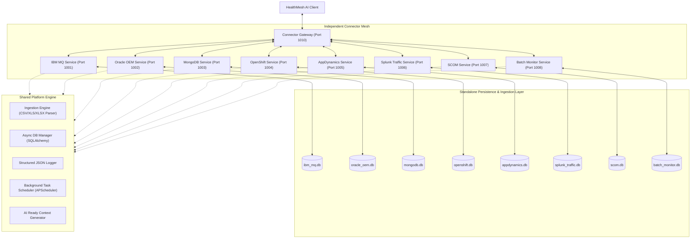

# HealthMesh Connector Mesh Backend Architecture

This document provides a comprehensive breakdown of the **HealthMesh Connector Mesh Backend Platform**. It operates as a highly scalable, federated microservices telemetry aggregator designed for automated anomaly discovery, topology mapping, and AI-ready diagnostics context injection.

---

## 🗺️ 1. Global Federated Architecture Overview

The system is organized as a flat monorepo combining a shared platform engine, eight fully independent FastAPI microservices, and a central Connector Gateway serving as the single-source-of-truth router for HealthMesh AI:

---

## 🏗️ 2. Capabilities of the Shared Platform Engine

To guarantee code reusability and microservice independence, core common routines are bundled within `shared/`:

1. **Structured Logging (`shared/logging/logger.py`)**:
   Standardized log formatter that outputs logs as production-grade JSON lines, providing context such as timestamp, service identity, log levels, and trace logs.

2. **Async DB Manager (`shared/database/session.py`)**:
   Constructs isolated database instances based on connection configuration. Leverages SQLAlchemy's asynchronous drivers (`sqlite+aiosqlite`) to manage session connection pools, perform schema creations, and safely commit/rollback transactions.

3. **High-Efficiency Ingestion Engine (`shared/ingestion/engine.py`)**:
   Fully autonomous CSV/Excel telemetry parser that:
   - Evaluates file headers and normalizes them into standard database formats.
   - Detects the closest registered schema configuration.
   - Conducts type validations and skips invalid or null records without crashing.
   - Filters out duplicates.
   - Outputs quality and confidence indicators: **HIGH** (90-100), **MEDIUM** (70-89), **LOW** (<70).
   - Generates unified transaction audit trail entries.

4. **Background Task Scheduler (`shared/scheduler/scheduler.py`)**:
   Integrates `APScheduler` into FastAPI's startup context lifecycle to periodically recalculate health scores, trigger alert queries, and simulate continuous operational metrics refreshes.

5. **AI Context Aggregator (`shared/ai/context.py`)**:
   Serializes the database status into an AI-ready context payload matching the mandated schema, ready for large language models to query and summarize.

---

## 🔌 3. Independent Connector Services (Ports 1001-1008)

Each connector microservice runs on its own port, maintains its own independent SQLite database file in its local folder, and operates without direct coupling to other connectors.

| Port | Service Name | Slug | Purpose |
| :--- | :--- | :--- | :--- |
| **1001** | `ibm-mq-service` | `ibm-mq` | Queue manager statuses, depths, channel retries, message throughputs, and queue backlog alarms. |
| **1002** | `oracle-oem-service` | `oracle-oem` | Active DataGuard replication delays, DR test statuses, sessions, and wait-event statistics. |
| **1003** | `mongodb-service` | `mongodb` | Replica Set status, sharding, primary-secondary splits, node latencies, and sync delays. |
| **1004** | `openshift-service` | `openshift` | Workload pod statuses, deployment degradation, restart loops, and CPU/RAM metrics. |
| **1005** | `appdynamics-service` | `appdynamics` | JVM node tiers, business transaction SLA latency triggers, call counts, and APM alerts. |
| **1006** | `splunk-traffic-service` | `splunk-traffic` | API success metrics, HTTP error ratios, retry frequency, and load balancer online statuses. |
| **1007** | `scom-service` | `scom` | Physical SCOM servers, CPU/RAM hypervisor loads, VM replications, and DR test runs. |
| **1008** | `batch-monitor-service`| `batch-monitor` | Batch cron schedules, executions, runtimes, and critical duration SLA delays. |

---

## 🌐 4. Connector Gateway Service (Port 1010)

The **Connector Gateway** aggregates the distributed, isolated connector mesh into a single API endpoint cluster:

1. **Connector Discovery & Heartbeats (`GET /connectors`)**:
   Dynamically sends non-blocking concurrent health inquiries to all registered service endpoints to verify status (ONLINE, DEGRADED, OFFLINE) and record network latencies.

2. **Federated Health Summary (`GET /aggregate-health`)**:
   Consolidates active alerts, computes overall mesh health, and summarizes operational states.

3. **Topology Federation (`GET /aggregate-topology`)**:
   Extracts isolated microservice node clusters, prefixes their IDs to ensure absolute uniqueness (preventing collision of hostnames or database cluster names), links them to an orchestrator node, and builds a comprehensive unified topology map.

4. **Aggregate Incident Alarms (`GET /aggregate-alerts`)**:
   Assembles a single chronological active alarm register.

5. **Aggregated AI Context (`GET /aggregate-ai-context`)**:
   Merges separate AI context summaries, calculating average scores and joining findings, warnings, recommendations, and drift analysis maps into a single JSON response.
