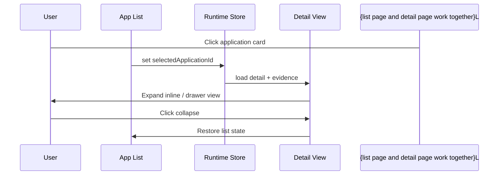
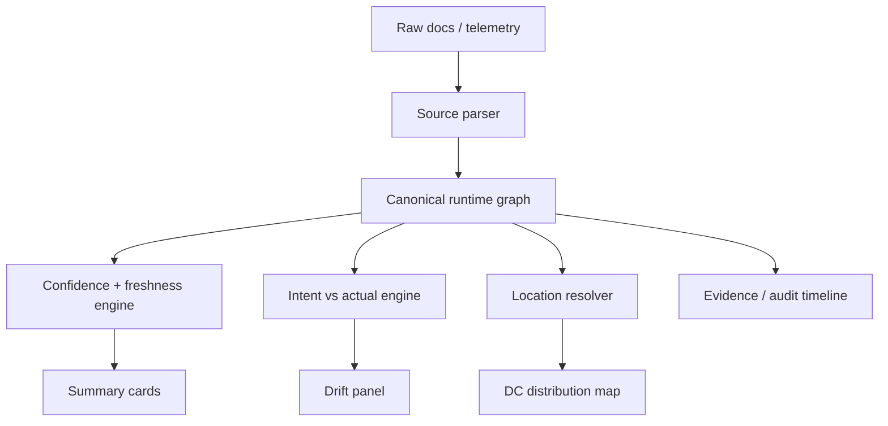
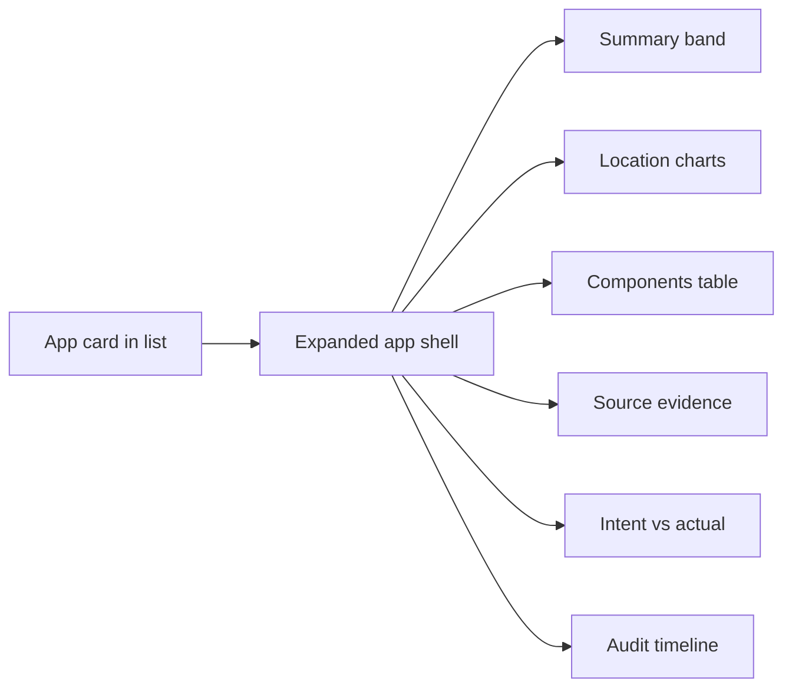

# Phase-Level Implementation Plan: Unified App -> Runtime -> Health Drilldown

## Goal
Create a single end-to-end experience where a user clicks an application card and the UI expands into a rich drill-down view showing:
- application hierarchy
- runtime locations
- dependencies
- source evidence
- confidence and freshness
- intent vs actual drift
- health and incident signals
- graphs and visuals for fast operator understanding

This plan is designed to fit the current LiveLens structure, especially `RuntimeLocationPage`, `ApplicationLocationDetailPage`, the runtime store, and the runtime components already present.

---

## Phase 0 - Finalize the UX contract

### Outcome
Define exactly what happens when a user clicks an app.

### Behavior
1. User lands on application list / runtime overview.
2. User clicks one app card.
3. The app card expands into a detail surface instead of feeling like a hard page jump.
4. The expanded surface shows:
   - overview strip
   - data center map
   - components table
   - source evidence panel
   - intent vs actual panel
   - drift/conflict warnings
   - snapshots / audit / compare tabs
5. User can collapse back to the list without losing scroll/context.

### UI contract
- Keep summary cards compact.
- Expand into a larger right panel, modal drawer, or inline accordion.
- Preserve the selected app state in URL so refresh/share works.
- Default tab on expand: `DC Distribution` or `Overview`.

### Decision to lock
- Use one of these patterns:
   - inline expand
   - full-width master/detail split
   - right-side drawer

Recommended: master/detail split on desktop + full-screen drilldown on mobile.

---

## Phase 1 – Normalize the data model

### Outcome
Every source contributes to one canonical application graph.

### Tasks
1. Standardize the application key:
   - uppercase `app_id`
   - consistent trimming and alias handling
2. Introduce one canonical entity graph:
   - Application
   - Component
   - Asset
   - Data Center
   - Source Evidence
   - Intent
   - Drift
   - Audit Event
3. Ensure every imported row maps to:
   - application id when possible
   - source name
   - environment
   - location candidate
   - confidence score
4. Add relation metadata for each asset:
   - `application_id`
   - `component_name`
   - `source_name`
   - `source_record_key`
   - `evidence_fields`
   - `location_source`

### Deliverable
A stable graph that can answer:
- what app is this?
- where is it running?
- what depends on it?
- what evidence supports that answer?

---

## Phase 2 – Build the app expansion model

### Outcome
Clicking an app reveals a richer hierarchy instead of just navigating away.

### Tasks
1. Add an `expandedApplicationId` state in the runtime store.
2. Track whether the app is:
   - collapsed
   - expanded inline
   - opened in detail view
3. Preserve the selected app in the URL:
   - `/runtime-location/:appId?env=PRODUCTION`
4. On click, load detail data if not already loaded.
5. Animate expansion with Framer Motion.
6. Support keyboard navigation and back action.

### Recommended interaction
- App list page remains visible.
- Selected app card transforms into a larger detail shell.
- Detail shell shows summary first, then graph sections below.

### Acceptance criteria
- Click app -> app expands in place.
- Click back/collapse -> returns to list.
- Browser refresh retains selected app.

---

## Phase 3 – Add the top-level visual hierarchy

### Outcome
The page visually communicates the app structure in a single glance.

### Visuals to include
1. **Application summary band**
   - app name
   - app id
   - environment
   - confidence
   - freshness
   - primary write DC
2. **Location distribution chart**
   - DC-wise bar chart or donut chart
3. **Component hierarchy tree**
   - application -> component -> asset
4. **Dependency graph**
   - app connected to MQ, DB, Kafka, OCP, LB
5. **Evidence chips**
   - source name
   - file name
   - row count
   - confidence contribution

### Recommended graph order
- summary band
- location graph
- component tree
- dependency graph
- detail tabs

---

## Phase 4 – Implement the expansion layout

### Outcome
The expanded app feels like a mini command center.

### Layout structure
1. **Header row**
   - app name
   - app id
   - environment pill
   - collapse button
2. **Quick summary row**
   - where it runs
   - which DC owns write state
   - confidence score
   - stale signals
3. **Main content area**
   - left: maps, graphs, components
   - right: evidence, drift, audit, intent
4. **Tabs / sections**
   - DC Distribution
   - Components
   - OpenShift Console
   - Intent vs Actual
   - Data Quality
   - Snapshots
   - Compare Envs
   - Audit Log

### UX recommendation
- On desktop, render as a two-column master/detail panel.
- On mobile, use tabs with stacked sections.

---

## Phase 5 – Add the graphs and visualizations

### Outcome
The app becomes explainable visually, not just textually.

### Graphs to implement
1. **DC Distribution chart**
   - shows assets per data center
   - highlight primary write DC
2. **Component composition chart**
   - DB / messaging / compute / storage breakdown
3. **Confidence trend chart**
   - confidence by data source or over snapshots
4. **Freshness heatmap**
   - fresh vs stale sources
   - heatmap for freshness
5. **Intent vs actual drift chart**
   - intended DCs vs discovered DCs
6. **Dependency graph**
   - app center node with downstream infra nodes
   - node-link graph for dependencies
7. **Audit timeline**
   - imports, drift detections, proposals, state changes

### Suggested chart types
- donut chart for component mix
- stacked bar for DC distribution
- timeline bars for snapshots

### Implementation note
Start with charts already easy to render with the current stack, then add node-link graphs only after the data model is stable.

---

## Phase 6 – Build the app drilldown journey

### Outcome
Every click opens progressively deeper evidence.

### Drilldown flow
1. Click app card
2. Open app detail shell
3. Expand to components
4. Expand component to assets
5. Expand asset to evidence
6. Expand evidence to source record

### Example drilldown chain
- Application: `1AAT`
   - Component: `DATABASE`
      - Asset: Oracle DB primary in `IBB1`
         - Evidence: `oem_db_role.xlsx`
         - Fields: `target_name`, `role_name`

### UX detail
- Each row should support a caret or expand button.
- Expanded rows should reveal:
   - source file
   - field values
   - confidence score
   - last updated time
   - conflict marker

---

## Phase 7 – Integrate intent vs actual

### Outcome
Users can compare what should exist vs what actually exists.

### Tasks
1. Render intent panel inside detail page.
2. Show intended active DCs.
3. Show intended primary DC.
4. Show required stacks.
5. Detect drift types:
   - missing DC
   - extra DC
   - wrong primary
   - missing component
6. Highlight drift severity.

### Visuals
- side-by-side intent vs actual table
- drift badges
- severity bars
- mismatch count summary

### Why it matters
This is the strongest judge-facing story because it shows the system is not just discovering topology; it is verifying it against desired state.

---

## Phase 8 – Add source evidence and trust layers

### Outcome
Every answer has a reason.

### Tasks
1. Render source panels per asset.
2. Show:
   - source type
   - source file
   - import time
   - record count
   - freshness
   - confidence contribution
3. Add conflict display:
   - text says one role
   - integer says another role
4. Add proposal workflow for new sources.

### Visual treatment
- green = verified
- amber = inferred or stale
- red = conflict
- gray = missing

---

## Phase 9 – Add hierarchy links from business to runtime

### Outcome
The health side and runtime side feel unified.

### Tasks
1. Add navigation from:
   - LOB -> SubLOB -> Team -> Project -> Component -> Application
2. Show runtime location data inside project/component pages.
3. Show health status alongside runtime topology.
4. Cross-link runtime app pages back into health pages.

### Visuals
- breadcrumb path
- hierarchy tree
- ownership map
- status badges by layer

---

## Phase 10 – Implement search, filter, and bulk discovery

### Outcome
Users can find apps quickly and compare estates.

### Tasks
1. Search by app name / id.
2. Filter by environment.
3. Filter by tech stack.
4. Filter by confidence level.
5. Filter by stale or conflict state.
6. Add bulk selection for comparison.

### Visuals
- search bar
- filter chips
- selected apps comparison strip

---

## Phase 11 – Add empty, partial, and corner states

### Outcome
The UI stays reliable when data is incomplete.

### Corner states
- app with only one source
- app with no DC yet
- app with conflicting sources
- app with stale sources
- app with missing intent
- app with active/standby flip
- app with multiple environments

### Required behavior
- do not hide missing data
- show explicit “missing signal” badges
- explain what is inferred vs confirmed

---

## Phase 12 – Build the page-level implementation sequence

### Recommended execution order
1. Lock the drilldown UX contract.
2. Normalize app-id and relation graph.
3. Add selected-app expansion state.
4. Wire app click to open expanded detail.
5. Add summary band and DC chart.
6. Add component table and evidence panel.
7. Add intent vs actual panel.
8. Add drift and conflict visualization.
9. Add snapshots and audit timeline.
10. Add comparison and compare-environments view.
11. Add mobile adaptation.
12. Add polish, transitions, and final QA.

---

## Phase 13 – Validation and judge-readiness

### Outcome
The feature is demonstrably complete.

### Validation checklist
- click app expands correctly
- collapse works
- URL preserves selected app
- graphs render with real data
- evidence links match source docs
- confidence and freshness are visible
- drift is detectable and explainable
- health and runtime are connected

### Judge story
When a judge asks “where is my app?”, the answer should be:
- it is running here
- primary write is here
- backup/secondary is here
- this is the evidence
- this is how confident we are
- this is what changed over time
- this is what should be true vs what is true

---

## Bottom line
The implementation should not be just “open a detail page.” It should be a true drilldown system:
click app -> expand app -> reveal hierarchy -> show evidence -> show graphs -> explain confidence -> compare intent vs actual -> audit changes

That is the end-to-end structure I recommend before coding.

---

## 14) File-mapped engineering checklist
This is the practical build order mapped to the current codebase so implementation can happen without redesigning the whole app.

### Phase A – Expand the runtime shell

**Primary files**
- `src/pages/RuntimeLocationPage.tsx`
- `src/pages/ApplicationLocationDetailPage.tsx`
- `src/store/runtimeLocationStore.ts`

**Work items**
1. Add selected-app expand/collapse state in the store.
2. Make app click open an expanded master/detail shell instead of only navigating away.
3. Keep URL state in sync with selected app and environment.
4. Preserve list scroll position when returning from detail.
5. Add a clear back/collapse action.

**Acceptance criteria**
- App card click expands the selected app.
- Collapse restores the list.
- Refresh reopens the same app detail.

### Phase B – Build the hierarchy visuals

**Primary files**
- `src/pages/ApplicationLocationDetailPage.tsx`
- `src/components/runtime/LocationMap.tsx`
- `src/components/runtime/TechStackIcon.tsx`
- `src/components/runtime/AssetStatusBadge.tsx`

**Work items**
1. Add a top summary band with app id, environment, confidence, freshness, and primary write DC.
2. Add a DC distribution chart.
3. Add a component breakdown chart.
4. Add expand/collapse rows for component -> asset -> evidence.
5. Add consistent color rules for primary, standby, stale, and conflict states.

**Acceptance criteria**
- User can visually see where the app runs.
- User can visually see which component maps to which runtime asset.

### Phase C – Connect data sources to evidence

**Primary files**
- `src/store/runtimeLocationStore.ts`
- `src/lib/csvParser.ts`
- `src/lib/api.ts`
- `backend/app/api/v1/endpoints/runtime.py`

**Work items**
1. Normalize `app_id`, `site`, `zone`, `namespace`, `cluster`, `hostname`, `pool`, and `tenant` into a common evidence model.
2. Persist source metadata per asset.
3. Capture which fields created the location decision.
4. Add missing-source counts for expected feeds not yet imported.
5. Show evidence chips in the UI.

**Acceptance criteria**
- Every rendered asset can explain how it was discovered.
- Every app summary can explain its location confidence.

### Phase D – Add intent vs actual and drift

**Primary files**
- `src/store/runtimeLocationStore.ts`
- `src/components/runtime/IntentVsActualTab.tsx`
- `src/pages/ApplicationLocationDetailPage.tsx`
- `backend/app/api/v1/endpoints/runtime.py`

**Work items**
1. Show intended active DCs and primary DC.
2. Compare against observed DCs and write owner.
3. Render drift types and severity.
4. Update alignment status in summary cards.
5. Keep backend drift and local drift consistent.

**Acceptance criteria**
- App detail makes intent mismatches obvious.
- Drift is visible both in list and detail.

### Phase E – Add graphs and timeline visuals

**Primary files**
- `src/pages/ApplicationLocationDetailPage.tsx`
- `src/components/runtime/AuditLogTab.tsx`
- `src/components/runtime/FreshnessIndicator.tsx`
- `src/components/runtime/ConfidenceBadge.tsx`

**Work items**
1. Add confidence trend or snapshot timeline.
2. Add freshness heat indicators by source.
3. Add audit timeline for import / drift / proposal events.
4. Add compare-environments chart.
5. Add dependency graph if hierarchy data is sufficient.

**Acceptance criteria**
- Each key question has a visual answer.
- The app page feels like an operational cockpit.

### Phase F – Health + runtime integration

**Primary files**
- `src/pages/HealthPage.tsx`
- `src/pages/ProjectHealthDashboardPage.tsx`
- `src/pages/RuntimeLocationPage.tsx`
- `src/App.tsx`

**Work items**
1. Link health hierarchy into runtime drilldown.
2. Add a cross-navigation path from project/component to runtime app.
3. Surface runtime confidence inside health views.
4. Surface health status inside runtime views.

**Acceptance criteria**
- Users can move from business ownership to runtime truth without context loss.

---

## 15) Recommended interaction diagrams

### Click-to-expand flow


### Data-to-visual pipeline

### Expandable app shell

## 16) Final build sequence you can follow
 1. Wire expand/collapse interaction in RuntimeLocationPage.tsx.
 2. Persist selected app and environment in the route.
 3. Ensure ApplicationLocationDetailPage.tsx loads the correct detail instantly.
 4. Add hierarchy visuals and summary band.
 5. Add source evidence rows and location reasoning.
 6. Add intent vs actual and drift badges.
 7. Add graphs for confidence, freshness, and snapshots.
 8. Link runtime with health pages.
 9. Polish empty states, conflicts, and stale-source warnings.
 10. Validate the click-to-expand flow on desktop and mobile.
## 17) Component-level implementation checklist
This section breaks the plan into the exact UI building blocks that need to change.
### App list shell
**Files**
 * src/pages/RuntimeLocationPage.tsx
**What to implement**
 1. Convert app card click into a real expand action.
 2. Preserve the list, but visually promote the selected app.
 3. Add a selected state and animation for the active card.
 4. Add a compact inline summary for primary DC and confidence.
**Expected result**
 * The user sees a list of apps, then one app expands into focus.
### Application detail shell
**Files**
 * src/pages/ApplicationLocationDetailPage.tsx
**What to implement**
 1. Add a top summary header.
 2. Add a main content grid with charts on one side and evidence on the other.
 3. Show tabs for map, components, intent, quality, snapshots, compare, and audit.
 4. Add a back/collapse button that restores the list.
**Expected result**
 * The expanded app reads like a mini command center.
### Data store and orchestration
**Files**
 * src/store/runtimeLocationStore.ts
 * src/lib/api.ts
 * src/lib/csvParser.ts
**What to implement**
 1. Store selected app id, selected environment, and expanded state.
 2. Cache loaded detail per app to avoid flicker.
 3. Keep imports, intent, drift, and proposals in sync after each load.
 4. Normalize source metadata for display and graph building.
**Expected result**
 * The UI feels consistent and data-driven, not reloaded from scratch every click.
### Summary and confidence widgets
**Files**
 * src/components/runtime/ConfidenceBadge.tsx
 * src/components/runtime/FreshnessIndicator.tsx
 * src/components/runtime/AssetStatusBadge.tsx
**What to implement**
 1. Make confidence readable at a glance.
 2. Show freshness clearly for each source and asset.
 3. Make state badges consistent across list and detail.
**Expected result**
 * The user instantly knows whether the data is strong, stale, or conflicting.
### Location and topology visuals
**Files**
 * src/components/runtime/LocationMap.tsx
 * src/components/runtime/TechStackIcon.tsx
 * src/components/runtime/DataCenterCard.tsx
**What to implement**
 1. Render data center distribution visually.
 2. Highlight primary write DC and standby sites.
 3. Use tech stack icons to show what each asset actually is.
**Expected result**
 * The user can answer “where is it running?” in one glance.
### Evidence and conflict panels
**Files**
 * src/components/runtime/DataSourcePanel.tsx
 * src/components/runtime/ConflictAlert.tsx
 * src/components/runtime/IntentVsActualTab.tsx
**What to implement**
 1. Show source-by-source evidence for each app.
 2. Highlight conflicts between source truth and inferred truth.
 3. Show intended vs actual placements and components.
**Expected result**
 * Every answer has a visible reason behind it.
### Audit, snapshots, and trends
**Files**
 * src/components/runtime/AuditLogTab.tsx
 * src/components/runtime/SnapshotTimeline inside ApplicationLocationDetailPage.tsx
**What to implement**
 1. Show a chronological trace of imports and state changes.
 2. Add a visual timeline for confidence / role snapshots.
 3. Make changes over time easy to compare.
**Expected result**
 * The user can see not only current state, but also recent behavior.
### Discovery and demo support
**Files**
 * src/components/runtime/DataDiscoveryPanel.tsx
 * src/components/runtime/IncidentModePanel.tsx
 * src/components/runtime/DemoWalkthroughOverlay.tsx
**What to implement**
 1. Provide guided discovery for unclear apps.
 2. Add incident-mode focus for high-priority failures.
 3. Use demo walkthroughs to explain the story during judging.
**Expected result**
 * The product is presentable in a live demo and easy to narrate.
## 18) Hackathon-winning priority roadmap
This is the end-to-end delivery order optimized for judging impact, clarity, and demo reliability.
### P0 - Must ship first
These are the non-negotiable pieces that make the solution feel complete.
 1. App click expands into a rich detail view.
 2. Summary band answers: where is it, which DC owns it, how confident are we.
 3. Data center distribution and component hierarchy are visible.
 4. Intent vs actual shows drift clearly.
 5. Evidence panels explain how each location was derived.
 6. Loading, empty, conflict, and stale states are handled gracefully.
**Why this wins**
 * Judges see a complete operational story, not just a dashboard.
 * The app answers the core question immediately: where is my app?
### P1 – High-value differentiators
These features make the solution feel smarter and more real-world.
 1. Confidence and freshness scoring across sources.
 2. Audit timeline for imports, changes, and drift.
 3. Compare environments view.
 4. Better source explanation chips with file-level evidence.
 5. Cross-link between health hierarchy and runtime truth.
 6. Search/filter by app, stack, environment, and confidence.
**Why this wins**
 * Judges see depth, trust, and explainability.
 * The product looks like a usable platform, not a prototype.
### P2 – Polishing and demo boost
These features increase wow-factor and presentation quality.
 1. Animated expand/collapse transitions.
 2. Visual dependency graph.
 3. Snapshot timeline.
 4. Guided walkthrough overlay.
 5. Incident mode panel.
 6. Beautiful responsive mobile fallback.
**Why this wins**
 * The demo becomes memorable and polished.
 * The UI feels complete when shown live.
## 19) End-to-end implementation order
Follow this exact order to avoid rework.
 1. Lock the UX contract for click-to-expand.
 2. Finish canonical app and asset normalization.
 3. Wire store state for selected app and expanded detail.
 4. Make the list page and detail page work together.
 5. Build summary, confidence, freshness, and primary DC display.
 6. Add component and data center visuals.
 7. Add evidence, source chips, and conflicts.
 8. Add intent vs actual and drift scoring.
 9. Add audit, snapshots, and compare views.
 10. Link runtime views to health hierarchy.
 11. Add search/filter and bulk compare.
 12. Add animation, walkthrough, and final polish.
## 20) Hackathon demo script
Use this flow live in the presentation.
 1. Start on the app list.
 2. Click a known app.
 3. Show expansion into runtime detail.
 4. Point to where it runs and who owns primary write.
 5. Show the component hierarchy and location distribution.
 6. Open intent vs actual and highlight drift.
 7. Open evidence panels and show source confidence.
 8. Switch to audit or snapshots to prove history.
 9. Jump into health hierarchy to show business linkage.
 10. End with the statement: this system tells me where the app is, why it is there, and whether it matches intent.
## 21) What judges should remember
 * One click reveals the full runtime truth.
 * The app is explainable through evidence, not guesses.
 * Health and runtime are unified.
 * Confidence, freshness, and drift are first-class.
 * The product answers a real operational pain point.
## 22) Final execution promise
If you build the P0 items first and keep the drilldown experience seamless, the solution will feel complete enough for a strong hackathon submission.
The winning edge comes from:
 * instant app expansion
 * strong visual hierarchy
 * trustworthy evidence
 * clear drift detection
 * polished demo storytelling
 * unified health + runtime narrative
```


```