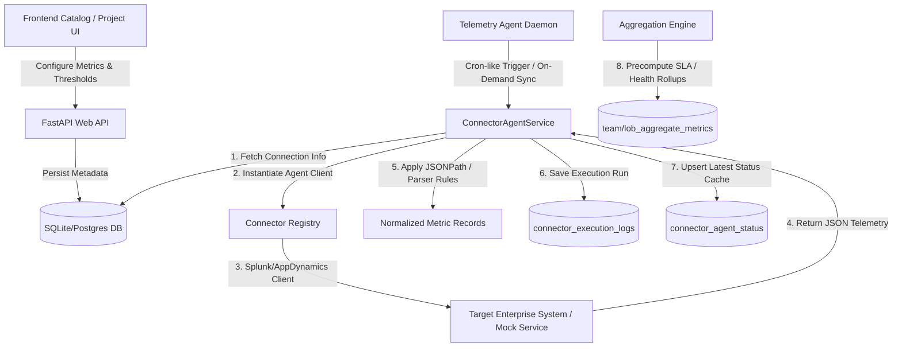
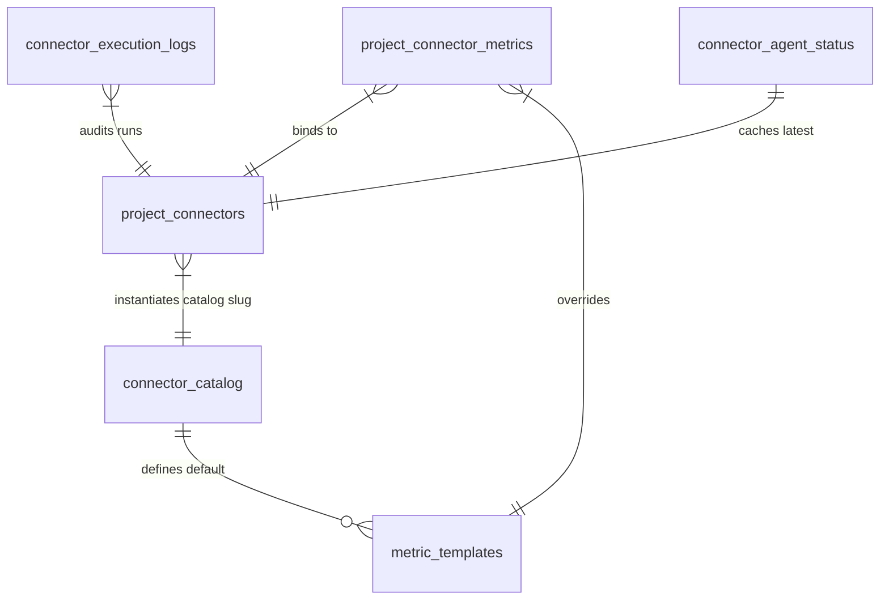

# HealthMesh Telemetry Architecture Analysis: Splunk & AppDynamics Metrics
This document provides an end-to-end architectural and technical analysis of the **Splunk** and **AppDynamics** telemetry integrations within the HealthMesh platform. It details the entire pipeline—from the user interface panels to backend execution loops, mock connectors, and relational database table structures.

---

## 1. High-Level Telemetry Flow


---

## 2. The Connector Catalog & Metric Panel (Frontend)
The user interface represents the entry point for configuring and visualizing metric templates for both connectors.

### A. Metric Template Manager (`MetricTemplateManager.tsx`)
The `MetricTemplateManager` React component is located in `src/components/catalog/MetricTemplateManager.tsx`. It provides a high-fidelity control panel for:
*   **Search & Filtration**: Allows operators to query metric templates by name, key, or category group (e.g., performance, latency, capacity, error rate).
*   **Default State Management**: Displays which metric templates are enabled by default vs. required system-level dependencies.
*   **Real-time Testing**: Integrates with the `MetricTemplateTestModal` to execute queries directly against the connector and preview output mapping prior to production deployments.
*   **Sequence Reordering**: Employs interactive up/down reordering controls to configure execution priority and dashboard layout rendering order.

### B. Metric Input and Query Configuration Form (`ConnectorMetricConfigForm.tsx`)
Concrete connector instances assigned to specific applications/projects can be customized using the forms in `src/components/catalog/ConnectorMetricConfigForm.tsx`:

| Connector | Config Fields | Purpose & Usage |
| :--- | :--- | :--- |
| **Splunk** | `search` | A raw Splunk Search Processing Language (SPL) query string (e.g., `search index=* level=ERROR \| stats count`). |
| | `time_range` | Relative search modifier constraint (e.g., `-1h`, `-30m`, `-24h`). |
| | `aggregation` | The reduction function applied to results (`sum`, `avg`, `max`, `min`, `count`). |
| | `parser_rules` | A JSONPath or RegEx parser definition to translate Splunk search response nodes into metrics. |
| **AppDynamics** | `metric_path` | Pipe-delimited hierarchical path inside the AppDynamics Metric Browser (e.g., `Overall Application Performance\|Calls per Minute`). |
| | `entity_selector` | Defines the API target scope (`APPLICATION`, `APPLICATION_COMPONENT` [Tier], `APPLICATION_COMPONENT_NODE`, `BUSINESS_TRANSACTION`, `BACKEND`). |

---

## 3. Database Schema & SQLAlchemy Models
The relational database layer stores everything from system-wide templates to immutable execution audit logs.

### A. Entity Relationship Table


### B. Table Structures
Below are the schema definitions for the key SQLAlchemy models located in `backend/app/models/`:

#### 1. `connector_catalog` (`ConnectorCatalogEntry`)
Stores the catalog definitions for Splunk and AppDynamics connectors.
```sql
CREATE TABLE connector_catalog (
    id VARCHAR PRIMARY KEY,
    slug VARCHAR UNIQUE NOT NULL,      -- 'splunk', 'appdynamics'
    name VARCHAR NOT NULL,
    description TEXT,
    vendor VARCHAR,
    category VARCHAR,                  -- 'observability' (Splunk), 'apm' (AppDynamics)
    status VARCHAR DEFAULT 'active',
    icon VARCHAR,
    color VARCHAR,                     -- '#FF6B35' (Splunk), '#00C0D1' (AppDynamics)
    tags TEXT,
    is_system BOOLEAN DEFAULT FALSE,
    is_enabled BOOLEAN DEFAULT TRUE,
    config_schema JSON,                -- JSON Schema for credentials/endpoints
    default_config JSON,               -- Default API ports and timeouts
    test_definition JSON,              -- Endpoint used to test connection credentials
    docs_url VARCHAR,
    version VARCHAR
);
```

#### 2. `metric_templates` (`MetricTemplate`)
Pre-seeded metric definitions map directly to catalog entries.
```sql
CREATE TABLE metric_templates (
    id VARCHAR PRIMARY KEY,
    catalog_entry_id VARCHAR REFERENCES connector_catalog(id) ON DELETE CASCADE,
    name VARCHAR NOT NULL,
    metric_key VARCHAR NOT NULL,       -- 'total_log_volume', 'apdex_score'
    description TEXT,
    category VARCHAR,                  -- 'performance', 'logs', 'apm', 'security'
    display_order INTEGER DEFAULT 0,
    metric_type VARCHAR NOT NULL,      -- 'number', 'percentage', 'duration', etc.
    unit VARCHAR,                      -- 'events', 'ms', '%', 'calls/min'
    aggregation_type VARCHAR,          -- 'sum', 'avg', 'max', 'latest'
    threshold_warning REAL,            -- Default Warning Threshold
    threshold_critical REAL,           -- Default Critical Threshold
    query_config JSON,                 -- Connection path, method, SPL or Metric Path
    parser_type VARCHAR,               -- 'json_path', 'regex', etc.
    result_mapping JSON,               -- e.g., {"value_path": "$.results[0].count"}
    is_enabled_by_default BOOLEAN,
    is_required BOOLEAN DEFAULT FALSE,
    is_custom BOOLEAN DEFAULT FALSE
);
```

#### 3. `project_connector_metrics` (`ProjectConnectorMetric`)
Manages custom threshold overrides and switches per active application.
```sql
CREATE TABLE project_connector_metrics (
    id VARCHAR PRIMARY KEY,
    project_connector_id VARCHAR NOT NULL REFERENCES project_connectors(id) ON DELETE CASCADE,
    metric_template_id VARCHAR NOT NULL REFERENCES metric_templates(id) ON DELETE CASCADE,
    is_enabled BOOLEAN DEFAULT TRUE,
    is_critical BOOLEAN DEFAULT FALSE,
    threshold_warning REAL,            -- Override instance threshold
    threshold_critical REAL,           -- Override instance threshold
    label_override VARCHAR,
    query_config_override JSON,        -- Custom SPL query override per application
    UNIQUE(project_connector_id, metric_template_id)
);
```

#### 4. `connector_execution_logs` (`ConnectorExecutionLog`)
An immutable historical audit trail logging every connection, sync run, latency response, and raw metrics snapshot.
```sql
CREATE TABLE connector_execution_logs (
    id VARCHAR PRIMARY KEY,
    project_connector_id VARCHAR REFERENCES project_connectors(id) ON DELETE CASCADE,
    triggered_by VARCHAR NOT NULL,      -- 'scheduled', 'manual', 'api'
    outcome VARCHAR NOT NULL,           -- 'success', 'failure', 'timeout', 'auth_error'
    response_time_ms INTEGER,           -- Execution response latency
    http_status_code INTEGER,
    error_message TEXT,
    raw_response_snippet TEXT,
    metrics_snapshot TEXT,              -- Serialized JSON snapshot of all fetched metrics
    executed_by VARCHAR REFERENCES users(id),
    executed_at TIMESTAMP NOT NULL DEFAULT CURRENT_TIMESTAMP
);
```

#### 5. `connector_agent_status` (`ConnectorAgentStatus`)
Caches the latest aggregate telemetry metrics per project connector for high-speed dashboard queries.
```sql
CREATE TABLE connector_agent_status (
    id VARCHAR PRIMARY KEY,
    project_connector_id VARCHAR UNIQUE REFERENCES project_connectors(id) ON DELETE CASCADE,
    health_status VARCHAR NOT NULL,    -- 'healthy', 'degraded', 'down', 'timeout'
    last_sync_at TIMESTAMP,
    last_sync_outcome VARCHAR,
    last_sync_response_ms INTEGER,
    last_error TEXT,
    last_error_at TIMESTAMP,
    consecutive_failures INTEGER DEFAULT 0,
    total_executions INTEGER DEFAULT 0,
    total_failures INTEGER DEFAULT 0,
    uptime_percentage INTEGER,
    last_metrics_snapshot TEXT,         -- Serialized JSON cache of latest active metrics
    updated_at TIMESTAMP
);
```

---

## 4. Pre-Seeded Metric Definitions (`seed.py` / `db/base.py`)
During system initialization, HealthMesh seeds standard, out-of-the-box metric templates into `metric_templates`:

### A. Splunk Metrics Catalog
Designed to ingest application operational health via log diagnostics.

| Metric Name | Key | Type | Unit | Default Warning | Default Critical | Target Mock / Enterprise Path |
| :--- | :--- | :--- | :--- | :--- | :--- | :--- |
| **Total Log Volume** | `total_log_volume` | number | events | 1,000,000 | 5,000,000 | `/services/search/jobs` (SPL: `* \| stats count`) |
| **Error Count** | `error_count` | number | errors | 100 | 500 | `/services/search/jobs` (SPL: `level=ERROR \| stats count`) |
| **Warning Count** | `warning_count` | number | warnings | 500 | 2,000 | `/services/search/jobs` (SPL: `level=WARN \| stats count`) |
| **Critical Error Count** | `critical_error_count` | number | events | 1 | 10 | `/services/search/jobs` (SPL: `level=CRITICAL \| stats count`) |
| **Exception Count** | `exception_count` | number | exceptions | 50 | 200 | `/services/search/jobs` (SPL: `(Exception OR Traceback OR "stack trace") \| stats count`) |
| **Unique Error Types** | `unique_error_types` | number | types | 10 | 50 | `/services/search/jobs` (SPL: `level=ERROR \| dedup message \| stats count`) |
| **Failed Transactions** | `failed_transactions` | number | transactions | 20 | 100 | `/services/search/jobs` (SPL: `status=failed OR status=error \| stats count`) |
| **Success Transactions** | `success_transactions` | number | transactions | - | - | `/services/search/jobs` (SPL: `status=success OR status=200 \| stats count`) |
| **Average Response Time** | `avg_response_time` | duration | ms | 500 | 2,000 | `/services/search/jobs` (SPL: `response_time=* \| stats avg(response_time)`) |
| **P95 Response Time** | `p95_response_time` | duration | ms | 1,000 | 3,000 | `/services/search/jobs` (SPL: `response_time=* \| stats perc95(response_time)`) |
| **P99 Response Time** | `p99_response_time` | duration | ms | 2,000 | 5,000 | `/services/search/jobs` (SPL: `response_time=* \| stats perc99(response_time)`) |
| **Throughput** | `throughput` | number | req/s | - | - | `/services/search/jobs` (SPL: `* \| bin _time span=1s \| stats count by _time \| stats avg(count)`) |
| **Request Rate** | `request_rate` | number | req/min | - | - | `/services/search/jobs` (SPL: `* \| bin _time span=1m \| stats count by _time \| stats avg(count)`) |
| **Failed Logins** | `failed_login_attempts` | number | attempts | 10 | 50 | `/services/search/jobs` (SPL: `("authentication failure" OR "login failed") \| stats count`) |
| **Suspicious Activity** | `suspicious_activity_count`| number | events | 5 | 25 | `/services/search/jobs` (SPL: `(suspicious OR anomaly OR "brute force") \| stats count`) |
| **Auth Failures** | `auth_failures` | number | failures | 20 | 100 | `/services/search/jobs` (SPL: `("permission denied" OR "unauthorized" OR "403" OR "401") \| stats count`) |
| **Host Availability** | `host_availability` | percentage | % | 95 | 90 | `/services/search/jobs` (SPL: `sourcetype=ping \| stats dc(host)`) |
| **Service Restarts** | `service_restarts` | number | restarts | 3 | 10 | `/services/search/jobs` (SPL: `("service restart" OR "process restart") \| stats count`) |
| **Deployment Events** | `deployment_events` | number | events | - | - | `/services/search/jobs` (SPL: `("deploy" OR "release" OR "rollout") \| stats count`) |

### B. AppDynamics Metrics Catalog
Designed to ingest runtime APM stats from the controller REST interface.

| Metric Name | Key | Type | Unit | Default Warning | Default Critical | AppDynamics Metric Browser Pipeline Path |
| :--- | :--- | :--- | :--- | :--- | :--- | :--- |
| **App Response Time** | `app_response_time` | duration | ms | 500 | 2,000 | `Overall Application Performance\|Average Response Time (ms)` (APPLICATION scope) |
| **Apdex Score** | `apdex_score` | number | score | 70 | 50 | `Overall Application Performance\|User Experience\|Apdex` (APPLICATION scope) |
| **Transaction Volume** | `bt_volume` | number | calls/min | - | - | `Overall Application Performance\|Calls per Minute` (APPLICATION scope) |
| **Error Rate** | `error_rate` | percentage | % | 1 | 5 | `Overall Application Performance\|% Errors` (APPLICATION scope) |
| **Slow Transactions** | `slow_transaction_count` | number | calls/min | 10 | 50 | `Overall Application Performance\|Slow Calls per Minute` (APPLICATION scope) |
| **JVM Heap Usage** | `jvm_heap_usage` | percentage | % | 75 | 90 | `JVM\|Memory:Heap\|Used (MB)` (NODE scope) |
| **Active JVM Threads** | `thread_count` | number | threads | 200 | 500 | `JVM\|Threads\|Current No. of Threads` (NODE scope) |
| **Garbage Collection Time** | `gc_time` | duration | ms/min | 1,000 | 5,000 | `JVM\|Garbage Collection\|GC Time Spent Per Min (ms)` (NODE scope) |

---

## 5. Execution Logic & Synchronizer Loop
The backend execution agent orchestrates connector synchronizations safely and asynchronously.

### A. Connector Registry System (`registry.py` & `interface.py`)
All connectors implement the `BaseConnector` interface and register themselves dynamically via python decorators.
*   **Splunk Registration**: `splunk` -> `SplunkConnector` (`splunk/connector.py`). Uses the Splunk Bearer Token auth strategy and manages internal HTTP connections via standard rest protocols.
*   **AppDynamics Registration**: `appdynamics` -> `AppDynamicsConnector` (`appdynamics/connector.py`). Translates credentials into basic auth composites (`username@account_name:password`).

### B. Connector Execution Loop (`ConnectorAgentService.sync_health`)
When a sync event runs (scheduled or manual trigger):

1.  **Retrieve Configurations**: Loads `ProjectConnector` state and parses credentials dynamically.
2.  **Authenticate**: Triggers the connector's internal `authenticate()` method to ensure session authorization remains active.
3.  **Fetch Health & Status**:
    *   **Splunk**: Hits `/services/server/health/splunkd` and maps status keys (`green` -> `healthy`, `yellow` -> `degraded`, `red` -> `down`).
    *   **AppDynamics**: Lists applications using `/controller/rest/applications?output=JSON` to verify controller health.
4.  **Fetch Telemetry metrics**:
    *   Invokes `connector_instance.fetch_metrics()`.
    *   Resolves custom query parameters and executes either Splunk SPL endpoints or AppDynamics API REST channels.
    *   Transforms raw arrays into unified `HealthMetric` lists (`name`, `value`, `unit`).
5.  **Log & Cache Generation**:
    *   Generates a serialized JSON representation of all normalized metrics and saves it as `metrics_snapshot` in `connector_execution_logs`.
    *   Upserts the calculated averages and statuses into the fast-read cache table `connector_agent_status` for UI dashboard displays.

---

## 6. The Mocking Layer (`healthmesh-connectors/connectors/`)
To support development and testing environments without active enterprise dependencies, HealthMesh runs localized microservices simulating real-world Splunk and AppDynamics servers:

### A. Splunk Mock Service (`splunk-service` on port `1016`)
Runs an internal SQLite database (`splunk.db`) to mock enterprise log endpoints:
*   **Log Exception Records (`LogExceptionRecord` Model)**: Generates sample entries matching real application logs (e.g., `NullPointerException` occurrences, `SqlTimeoutException` errors).
*   **Ingestion Endpoint (`endpoints.py`)**:
    *   `/alerts`: Detects instances where occurrences exceed threshold limits (>50 hits) and returns normalized system alerts.
    *   `/ai-context`: Packages metric levels, health scores, drift changes, and recommendation text dynamically. If exception levels rise, the API reduces the index health score by `20.0` points per exception type and raises critical warnings.
    *   `/topology`: Maps nodes (indexer clusters, databases, active exceptions) and returns edge vectors representing network dependencies.

### B. AppDynamics Mock Service (`appdynamics-service` on port `1005`)
Simulates business application transactions, garbage collection occurrences, tier structures, and CPU/Memory limits. Provides responses formatted exactly like Cisco AppDynamics Controller JSON endpoints.

---

## Summary of Metric Architectural Lifecycle
> [!NOTE]
> 1. **Catalog Definition**: The system loads the baseline schema in `db/base.py`.
> 2. **Metric Association**: When configuring a concrete project instance, default templates copy over into `project_connector_metrics`.
> 3. **UI Customization**: Operators can override specific thresholds (warning/critical) or customize search queries using `ConnectorMetricConfigForm`.
> 4. **Asynchronous Scraping**: `ConnectorAgentService` triggers regularly, queries Splunk/AppDynamics APIs, extracts metrics using JSONPath parser rules, and archives the values as serialized JSON inside `ConnectorExecutionLog`.
> 5. **Aggregated Status Cache**: Active values overwrite `ConnectorAgentStatus`, allowing components like team health panels and drift graphs to retrieve telemetry information instantly.
