# Excel Telemetry Sources: Metadata and Relationships

This document provides a comprehensive inventory of the Excel (`.xlsx`) files located in the `docs` directory, including their sheet names, column headers, and how their data models correlate to resolve the core problem of **Application Runtime Location Visibility** (answering *"Where Is My App Running?"*).

---

## 1. File Inventory and Headers

### 1.1 AppDynamics_Node_Inventory.xlsx
* **Sheet Name**: `AppDynamics_Node_Inventory`
* **Headers**:
  * `app_id` (String) — The unique short identifier of the application (e.g., `10AM`).
  * `node_name` (String) — The logical AppDynamics node name.
  * `app_full_name` (String) — The descriptive application name (e.g., `10AM_CTDSAccessManagementTool`).
  * `machine_name` (String) — The physical or virtual hostname running the application node.
  * `tier_name` (String) — The logical deployment tier (e.g., `10AM-PROD-AZ`).

### 1.2 AppDynamics_Traffic_Raw_sample_consolidated.xlsx
* **Sheet Name**: `AppDynamics_Traffic_Raw_sample_`
* **Headers**:
  * `id` (Integer) — Row identifier.
  * `app_id` (String) — The unique short identifier of the application (e.g., `1AUTHB`).
  * `app_full_name` (String) — The full application name (e.g., `1AUTHB_WIMAuthenticationHub`).
  * `metric_id` (Integer) — Unique metric identifier.
  * `metric_name` (String) — Name of the metric (e.g., `BTM|Application Summary|Component:25088|Calls per Minute`).
  * `metric_path` (String) — Full hierarchical metric path indicating specific host and node paths.
  * `frequency` (String) — Reporting frequency (e.g., `ONE_MIN`).
  * `start_time_ms` (Integer) — Start timestamp in milliseconds.
  * `occurences` (Integer) — Number of sample occurrences.
  * `current_value` (Integer) — Current performance metric value.
  * `min_value` (Integer) — Minimum value in the bucket.
  * `max_value` (Integer) — Maximum value in the bucket.
  * `value` (Integer) — Calculated metric value.
  * `sum_value` (Integer) — Sum of metric values.
  * `count_value` (Integer) — Count of values.
  * `bucket_start` (Integer) — Bucket time identifier.
  * `load_date` (DateTime) — Date the metric was loaded.
  * `fetched_at` (DateTime) — Date the metric was fetched.
  * `unnamed_or_timestamp` (DateTime) — Raw measurement timestamp.

### 1.3 SPLOC_App_Traffic_Sample.xlsx
* **Sheet Name**: `SPLOC_App_Traffic_Sample`
* **Headers**:
  * `id` (Integer) — Row identifier.
  * `app_id` (String) — The unique short identifier of the application (e.g., `1SSP`).
  * `ts_id` (String) — Time series identifier.
  * `wf_dc` (String) — Active location / physical data center (e.g., `WEC`, `OXM`).
  * `sf_service` (String) — Microservice or endpoint name (e.g., `1SSP_PROD_ACTIONQ`).
  * `wf_acln` (String) — Client network connectivity path identifier.
  * `total_value` (Integer) — Sum of requests in the window.
  * `sample_count` (Integer) — Count of traffic samples.
  * `avg_value` (Float) — Average request value.
  * `bucket_start` (DateTime) — Starting time for the measurement bucket.
  * `duration_mins` (Integer) — Duration of the bucket in minutes.
  * `load_date` (DateTime) — Load date.
  * `fetched_at` (DateTime) — Extraction timestamp.

### 1.4 gslb_report_virtual_services.xlsx
* **Sheet Name**: `gslb_report_virtual_services`
* **Headers**:
  * `name` (String) — The virtual service load balancer VIP name.
  * `enabled` (Boolean/Integer) — Flag indicating if the VIP is active.
  * `tenant` (String) — Environment/Tenant string (e.g., `1sep-prod`).
  * `app_id` (String/Date) — The linked application ID. *(Note: App IDs starting with `1sep` are parsed by Excel as date objects like `2026-09-01`).*
  * `controller` (String) — Fully qualified domain name of the load balancer controller.
  * `pool` (String) — Traffic pool name.
  * `site` (String) — Physical load balancer site/data center.
  * `zone` (String) — Network zone (e.g., `std`).
  * `neighborhood` (String) — Network topology neighborhood identifier (e.g., `NH01`).

### 1.5 ibmmq_qmgr_command_server_status.xlsx
* **Sheet Name**: `ibmmq_qmgr_command_server_statu`
* **Headers**:
  * `_name_` (String) — Metric identifier name.
  * `agent_hostname` (String) — Hostname of the monitoring agent.
  * `description` (String) — Description text.
  * `env` (String) — Deployment environment (e.g., `UAT`, `PRODUCTION`).
  * `exported_qmgr` (String) — Exported Queue Manager name (e.g., `EL4UR1V`).
  * `hostname` (String) — Target host server.
  * `instance` (String) — Instance port mapping details.
  * `job` (String) — Monitoring job name (e.g., `ibm-mq`).
  * `mq_namespace` (String) — Messaging namespace.
  * `platform` (String) — Server platform (e.g., `UNIX`).
  * `qmgr` (String) — Active Queue Manager identifier.
  * `cluster` (String) — MQ Cluster identifier (if member of a cluster).
  * `Value` (Integer) — Operational state metric value.

### 1.6 mongodb_info.xlsx
* **Sheet Name**: `mongodb_info`
* **Headers**:
  * `_name_` (String) — Data type label.
  * `agent_hostname` (String) — Hostname of the collector agent.
  * `cl_name` (String) — Database cluster name.
  * `cl_role` (String) — Node cluster role (e.g., `configsvr`, `mongos`, `shard`).
  * `collector_id` (String) — Unique collector ID.
  * `env` (String) — Target environment (e.g., `uat_ngdc`).
  * `group_id` (String) — Project group ID.
  * `hostname` (String) — Server hostname.
  * `instance` (String) — MongoDB instance name.
  * `job` (String) — Monitoring job name (contains application scope, e.g., `CAPMU_DEV-mongo-metrics`).
  * `mongodb_version` (String) — DB engine version.
  * `org_id` (String) — Organization ID.
  * `process_port` (Integer) — Network port.
  * `process_type` (String) — Daemon process type (e.g., `config`, `mongos`, `mongod`).
  * `replica_state_name` (String) — Node replication state (e.g., `primary`, `secondary`, `none`).
  * `rs_nm` (String) — Replica set name (e.g., `csrs_d0capmu`).
  * `rs_state` (Integer) — Numeric replication state representation.
  * `Value` (Integer) — Primary status metric value.

### 1.7 ocp_pod_info.xlsx
* **Sheet Name**: `ocp_pod_info`
* **Headers**:
  * `cluster` (String) — Kubernetes cluster identifier.
  * `env` (String) — Deployment environment (e.g., `prod`).
  * `lob` (String) — Line of Business owner (e.g., `cto`).
  * `namespace` (String) — Kubernetes namespace (represents application namespace, e.g., `ocp-unit-test`).
  * `neighborhood` (String) — Logical network neighborhood (e.g., `NH01`).
  * `pod` (String) — Individual container pod name.

### 1.8 oem_db_role_data.xlsx
* **Sheet Name**: `oem_db_role_data`
* **Headers**:
  * `__name__` (String) — Metric identifier name.
  * `agent_hostname` (String) — OEM agent hostname.
  * `collector_id` (String) — Collector ID.
  * `env` (String) — Target environment.
  * `instance` (String) — Database instance identifier.
  * `job` (String) — Monitoring job name.
  * `role_name` (String) — Database role (e.g., `PRIMARY`, `PHYSICAL STANDBY`).
  * `target_name` (String) — Full database connection target string (contains application code, e.g., `U6170052_DANUXL6170DB01`).
  * `Value` (Integer) — Numeric status indicator.

---

## 2. Dynamic Correlation and Relationships with Respect to App Name

In order to resolve the **Application Runtime Location Visibility** challenge, the enterprise must reconstruct the relationships between individual infrastructure assets (VMs, databases, pods, load balancers) and group them under a unified application context. 

The primary correlation key is the **Application ID (App ID)** (or App Name). Since the telemetry files come from different monitoring tools, some provide the App ID directly, while others require extraction rules.

### 2.1 The Application Correlation Model

The table below describes how the App ID is mapped, matched, or extracted across all files:

| File Name | Relationship Field | Correlation / Extraction Logic | Example Match |
| :--- | :--- | :--- | :--- |
| **AppDynamics_Node_Inventory.xlsx** | `app_id` / `app_full_name` | **Direct match.** Provided explicitly in the spreadsheet. | `10AM` $\rightarrow$ `10AM_CTDSAccessManagementTool` |
| **AppDynamics_Traffic_Raw_sample_consolidated.xlsx** | `app_id` / `app_full_name` | **Direct match.** Provided explicitly in the spreadsheet. | `1AUTHB` $\rightarrow$ `1AUTHB_WIMAuthenticationHub` |
| **SPLOC_App_Traffic_Sample.xlsx** | `app_id` | **Direct match.** Provided explicitly in the spreadsheet. | `1SSP` $\rightarrow$ `1SSP Application` |
| **gslb_report_virtual_services.xlsx** | `app_id` | **Direct match** (requires data cleaning for date-coerced values like `2026-09-01` back to `1sep`). | `1ofw` $\rightarrow$ `1ofw Application` |
| **ibmmq_qmgr_command_server_status.xlsx** | `qmgr` / `exported_qmgr` | **Regex Extraction.** Looks for 3+ letter uppercase acronyms. Falls back to `MQ_INFRA` if no specific app matches. | `EL4UR1V` $\rightarrow$ Extracts `EL` and `UR` as candidate components. |
| **mongodb_info.xlsx** | `job` | **Delimited Extraction.** Splits the monitoring job name by `-` or `_` and extracts the first token in uppercase. | `CAPMU_DEV-mongo-metrics` $\rightarrow$ `CAPMU` |
| **ocp_pod_info.xlsx** | `namespace` | **Direct conversion.** Converts the OCP namespace name to uppercase. | Namespace `ocp-unit-test` $\rightarrow$ `OCP-UNIT-TEST` |
| **oem_db_role_data.xlsx** | `target_name` | **Delimited Extraction.** Splits the database target name by `_` and extracts the first token in uppercase. | `U6170052_DANUXL6170DB01` $\rightarrow$ `U6170052` |

---

### 2.2 Reconstructed Topology and Relationship Flow

By correlating all these telemetry sources via the App ID, the system builds a full-stack runtime hierarchy. This connects network traffic ingestion down to compute, messaging, and database nodes:

```mermaid
graph TD
    %% Define Application Node
    App["Application (App ID: e.g., CAPMU)"]
    
    %% Traffic Ingestion
    subgraph Traffic / Ingress Layer
        GSLB["GSLB Virtual Service (gslb_report_virtual_services.xlsx)"]
        SPLOC["Active Traffic Volume (SPLOC_App_Traffic_Sample.xlsx)"]
        AppD_T["AppD Performance metrics (AppDynamics_Traffic_Raw_sample_consolidated.xlsx)"]
    end
    
    %% Compute Layer
    subgraph Compute Layer
        OCP["Container Pods (ocp_pod_info.xlsx)"]
        VM["Virtual Machines (AppDynamics_Node_Inventory.xlsx)"]
    end
    
    %% Middleware / Messaging
    subgraph Messaging Layer
        MQ["IBM MQ Queue Managers (ibmmq_qmgr_command_server_status.xlsx)"]
    end
    
    %% Database Layer
    subgraph Database Layer
        Mongo["MongoDB replica sets (mongodb_info.xlsx)"]
        Oracle["Oracle databases (oem_db_role_data.xlsx)"]
    end

    %% Connect App to Layers
    App -->|Inbound Routing| GSLB
    App -->|Active Traffic load| SPLOC
    App -->|Dynamic Performance| AppD_T
    
    App -->|Runs containers in| OCP
    App -->|Runs tiers on VMs| VM
    
    App -->|Sends messages via| MQ
    
    App -->|Saves state in replica| Mongo
    App -->|Persists core records in| Oracle

    %% Style definitions
    style App fill:#3B82F6,stroke:#1D4ED8,stroke-width:2px,color:#FFF
    style Traffic fill:#ECFDF5,stroke:#10B981,stroke-width:1px
    style Compute fill:#EFF6FF,stroke:#3B82F6,stroke-width:1px
    style Messaging fill:#FFF7ED,stroke:#F97316,stroke-width:1px
    style Database fill:#FDF2F8,stroke:#EC4899,stroke-width:1px
```

---

### 2.3 Solving the Visibility Gaps: Active vs. Passive Posture

Using these files together allows the system to determine actual runtime locations instead of just deployment inventory:

1. **Deployment Intent vs. Runtime Reality**: `gslb_report_virtual_services.xlsx` shows where traffic is *intended* to go, while `SPLOC_App_Traffic_Sample.xlsx` and `AppDynamics_Traffic_Raw_sample_consolidated.xlsx` indicate where requests are *actually* arriving in real-time.
2. **Data Replication Validation**: For database nodes, `oem_db_role_data.xlsx` (Oracle) and `mongodb_info.xlsx` (Mongo) identify which node has **write authority** (Primary role) versus standby readers (Physical Standby/Secondary). This prevents data corruption during failovers by verifying that write-traffic only hits the active primary site.
3. **Drift Detection**: When deployment targets change, comparing the live active nodes with the intended architecture highlights drift, low-confidence topology mapping, and potential single-points-of-failure.
